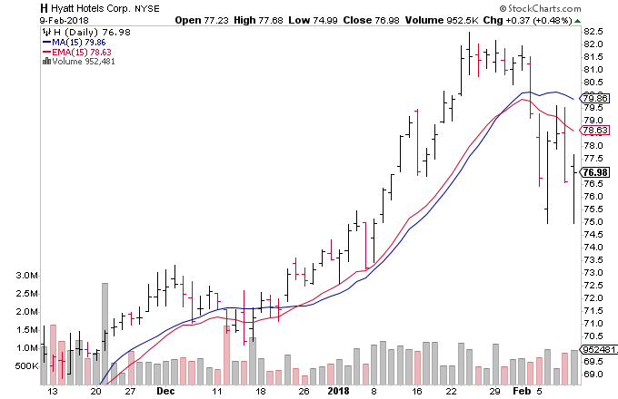

# Moving Average (滑动均值)

**滑动均值(MA)**： 用来衡量发展趋势的是个技术指标, 是根据过去的一系列 数据组 计算出来的的均值。有两种

1. Simple moving average (简单滑动均值)
2. Exponential moving average (指数滑动均值)

 

## 1. Simple moving average （简单滑动均值）
--------

计算方法就是计算数据中每 n 个点的均值，比如对于每天的股票变化，其10日均值就是过去10个数据的总和 除以 10，公式如下

$$SMA=\frac{A_1+A_2+...+A_n}{n}$$

如下图

之所以叫滑动，是因为要类似窗口移动一样，对每个连续的10个points做均值，如下图

 

对于一组数据，我们可以画多条滑动均值线，均值的跨度越大，则其曲线变化越平缓；反之越贴近原始数据的变化

比如下图，是一个3个月时间段内的股票价格变化 (红色 代表的是15日均线，蓝色 代表的是50日均线)

1. 50日均线相对股价变化来说更加平缓，因为它在计算时使用了更多的点
2. 可以根据两条均线的远近与否来判断近期的走势（实际上并不准确，因为股票的价格不是根据过去数据决定的）
3. 当短期均线越来越比长期均线高的时候，可以粗略的判断短期的将来，价格是向上的
4. 还可以根据两条均线的交点做一些粗略的判断

 

## 2. Exponential moving average （指数滑动均值）
--------

公式如下：

&ensp;&ensp;&ensp;&ensp;$EMA=(P*\alpha)+(Previous\_EMA *(1-\alpha))$

&ensp;&ensp;&ensp;&ensp;$P=Current\_Price$

&ensp;&ensp;&ensp;&ensp;$\alpha=\frac{2}{1+N}\ \ (Smoothing\_factor)$

&ensp;&ensp;&ensp;&ensp;$N=Number of Time Periods$

这个公式就是把当前的价格的权重加大了

 

## 3. SMA VS EMA （二者的比较）
--------

如下图所示，EMA对于, 价格下跌时的变动更加敏感，剧烈。据说是这个原因，导致分析师更喜欢用SMA

当我们知道了均线变化的原理后，在选择用多长时间作为跨度是就全凭试验了，因为跨度越小对短期变化越敏感，反之越不敏感

